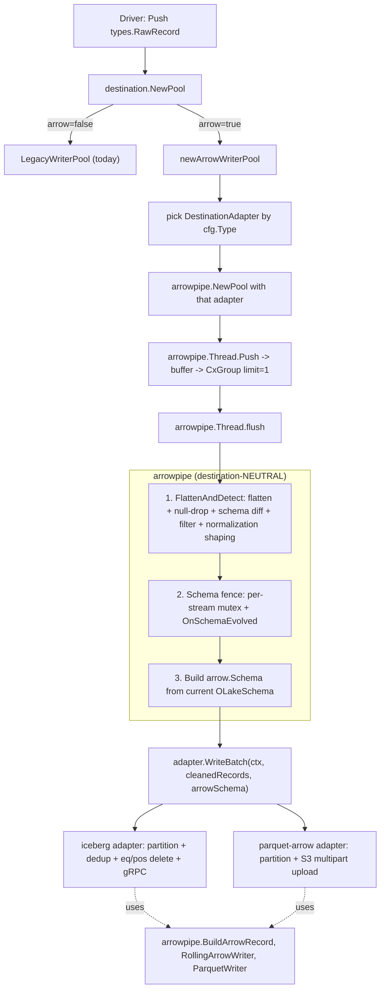

# Arrow Writer Implementation Plan

This doc is the **next step** after `docs/writer-pool-abstraction.md`. The pool dispatch layer is already in place: `destination.Pool` / `destination.Thread` interfaces, `LegacyWriterPool` + `LegacyWriterThread` (today's behaviour), and an `ArrowWriterPool` + `ArrowWriterThread` **stub**. The `--arrow-writer` CLI flag on `olake sync` selects between them.

Now we replace the stub with a real arrow pipeline that supports **two destinations** — Iceberg-arrow and Parquet-arrow — while keeping every piece of **destination-neutral** logic in exactly one place: the `arrowpipe` package.

---

## 1. Boundary (settled)

- **Abstraction (`destination/arrowpipe/`)** = destination-neutral compute + common arrow utils.
  - flatten, drop null-typed fields, schema diff & evolution, type-promotion rules, normalization shaping, common-ancestor merge
  - `BuildArrowRecord` (RawRecord batch → `arrow.Record`)
  - `RollingArrowWriter` (size-based parquet rolling, 0-row guard)
  - `ParquetWriter` wrapper + `DefaultParquetWriterProps`
  - `OLakeSchema` ↔ `arrow.Schema` mapping
  - `NormaliseOpType` — exported helper, **never called automatically** by the core
- **Destination adapters** = everything iceberg-flavoured or parquet-flavoured.
  - Iceberg keeps its arrow writer (`destination/iceberg/arrow-writer/`) almost intact: partition routing (transforms.go), dedup, equality + positional delete writers, gRPC, Java server lifecycle, 2PC, commit ordering.
  - Parquet-arrow is a brand-new `destination/parquet-arrow/` mirroring the iceberg-arrow shape minus iceberg-specific bits.

**Why op-type rewrite stays in the destination:** Iceberg uses the original `"i"` op-type as the signal to emit an equality delete during the backfill overlap window. If the core rewrote `"i" → "c"` before handing the batch to the adapter, that signal would be lost. So `arrowpipe.NormaliseOpType` is provided as a pure helper and each adapter calls it at the right point:

- Iceberg adapter → **after** `dedup.Track` (so dedup sees the original `"i"`)
- Parquet-arrow adapter → **before** `BuildArrowRecord` (no dedup; rewrite is unconditional)

---

## 2. File layout after this work

```
destination/
  writer.go                # unchanged (Pool/Thread interfaces, NewPool dispatcher)
  legacy_pool.go           # unchanged (today's behaviour)
  arrow_pool.go            # REWRITTEN: becomes a thin wrapper that constructs
                           # an arrowpipe.Pool and the right DestinationAdapter
                           # based on cfg.Type (Iceberg | Parquet)
  interface.go             # unchanged
  arrowpipe/               # NEW package - all destination-neutral logic lives here
    pool.go                # Pool + Thread + buffer/CxGroup + per-stream schema mutex + flush loop
    compute.go             # FlattenAndDetect + schema merge + type promotion rules
                           # + NormaliseOpType (helper)
    arrowschema.go         # OLakeSchema typedef + ToArrowField + ToArrowSchema
    arrowutil.go           # BuildArrowRecord + RollingArrowWriter + ParquetWriter wrapper
                           # + DefaultParquetWriterProps
    adapter.go             # DestinationAdapter interface + Setup / SchemaShape / PartitionPreShape
  iceberg/arrow-writer/    # UNCHANGED files for transforms.go, utils.go
    writer.go              # SHRUNK ~140 LOC: loses FlattenAndCleanData + EvolveSchema body +
                           # type-promotion rules; otherwise identical. Becomes the iceberg Adapter.
  parquet-arrow/           # NEW destination
    writer.go              # ~400 LOC adapter, mirrors iceberg-arrow shape minus dedup / eq-deletes
    config.go              # bucket/region/endpoint/prefix/path (mirrors today's parquet config)
```

The existing `destination.ArrowWriterPool` / `ArrowWriterThread` stub goes away; the stub's job is now done by `arrowpipe.Pool` / `arrowpipe.Thread`. The single line that constructs the right pool moves into `arrow_pool.go`'s `newArrowWriterPool`.

---

## 3. End-to-end flow



---

## 4. The adapter contract — `destination/arrowpipe/adapter.go`

Single small file. Defines what every arrow destination must implement.

```go
package arrowpipe

import (
	"context"

	"github.com/apache/arrow-go/v18/arrow"
	"github.com/datazip-inc/olake/types"
)

// OLakeSchema is the canonical destination-neutral schema representation.
type OLakeSchema map[string]types.DataType

// Options is the per-thread bag of flags lifted from destination.Options.
type Options struct {
	ThreadID    string
	Identifier  string
	Number      int64
	Backfill    bool
	ApplyFilter bool
	UpsertMode  bool // computed from !Backfill && !AppendMode
}

// SchemaShape lets the adapter declare how the abstraction should build the
// arrow.Schema from an OLakeSchema.
//
// Iceberg fills FieldIDs (PARQUET:field_id metadata) and IdentifierField
// (_olake_id non-null). Parquet-arrow leaves both empty.
type SchemaShape struct {
	FieldIDs        map[string]int32 // empty -> no PARQUET:field_id metadata
	IdentifierField string           // "" -> all fields nullable
}

// PartitionPreShape declares which source->destination key copies the core
// should perform for normalization=false batches BEFORE handing them to the
// adapter. Iceberg uses this because its partition spec references the
// reformatted destination column name, but record.Data still carries the
// original key when normalization is off. Parquet-arrow leaves this empty.
type PartitionPreShape struct {
	SourceField string // matches record.Data keys BEFORE pre-shape
	DestField   string // utils.Reformat(SourceField); matches arrow schema AFTER pre-shape
}

// Setup is returned by DestinationAdapter.Setup. The abstraction stores the
// schema + shape + state per stream so subsequent threads reuse them.
type Setup struct {
	Schema          OLakeSchema
	Shape           SchemaShape
	State           *types.MetadataState // Iceberg 2PC state; nil for parquet-arrow
	PartitionFields []PartitionPreShape  // empty when adapter needs no pre-shape
}

// DestinationAdapter is the 4-method interface every arrow destination
// implements. The Iceberg adapter today's destination/iceberg/arrow-writer
// can be wrapped to satisfy it; parquet-arrow is brand new.
type DestinationAdapter interface {
	// Setup is called once per writer thread. The adapter validates partition
	// spec, starts servers/clients, fetches table metadata / 2PC state, builds
	// its initial schema and SchemaShape, and returns them.
	Setup(ctx context.Context, stream types.StreamInterface, opts *Options,
		incoming OLakeSchema) (Setup, error)

	// WriteBatch receives:
	//   - records: already flattened, filtered, normalization-shaped, op-type-untouched
	//   - arrowSchema: built from the current OLakeSchema + SchemaShape
	//
	// Adapter is responsible for:
	//   - partition routing
	//   - dedup decisions (Iceberg only)
	//   - calling arrowpipe.NormaliseOpType(&rec) at the right point
	//   - arrow.Record construction via arrowpipe.BuildArrowRecord
	//   - rolling parquet writes via arrowpipe.RollingArrowWriter
	//   - accumulating commit metadata for Close
	WriteBatch(ctx context.Context, records []types.RawRecord, arrowSchema *arrow.Schema) error

	// OnSchemaEvolved is invoked under the per-stream mutex by the abstraction
	// when MergeSchemas reports a real change. Adapter publishes the change
	// (Iceberg: EVOLVE_SCHEMA + re-fetch JSONSCHEMA; Parquet-arrow: no-op),
	// returns the SchemaShape for the new schema so the core can rebuild the
	// arrow.Schema for next WriteBatch.
	OnSchemaEvolved(ctx context.Context, newSchema OLakeSchema) (SchemaShape, error)

	// Close is invoked unconditionally (even on ctx cancel). The core has
	// already flushed the pending buffer before Close runs.
	// Iceberg: REGISTER_AND_COMMIT with finalMetadataState; close Java server.
	// Parquet-arrow: close rollers (Persist already happened on roll); on
	// ctx cancel also delete local artifacts.
	Close(ctx context.Context, finalMetadataState any) error
}
```

---

## 5. Pool + Thread — `destination/arrowpipe/pool.go`

This is the bulk of the abstraction. Most of the shape mirrors `destination.LegacyWriterThread` so behaviour stays familiar.

```go
package arrowpipe

import (
	"context"
	"fmt"
	"sync"

	"github.com/apache/arrow-go/v18/arrow"
	"github.com/datazip-inc/olake/destination"
	"github.com/datazip-inc/olake/types"
	"github.com/datazip-inc/olake/utils"
	"github.com/datazip-inc/olake/utils/logger"
)

// AdapterInit lets the outer dispatcher inject the right adapter constructor.
type AdapterInit func() DestinationAdapter

type streamArtifact struct {
	mu          sync.RWMutex
	schema      OLakeSchema
	shape       SchemaShape
	arrowSchema *arrow.Schema
	state       *types.MetadataState
	preShape    []PartitionPreShape
}

// Pool implements destination.Pool.
type Pool struct {
	configMutex  sync.Mutex
	stats        *destination.Stats
	cfg          any
	adapterInit  AdapterInit
	writerSchema sync.Map // streamID -> *streamArtifact
	batchSize    int64
}

func NewPool(ctx context.Context, cfg *types.WriterConfig, syncStreams []string,
	batchSize int64, adapterInit AdapterInit,
) (*Pool, error) {
	// Single Check() is performed by the adapter inside the first Setup.
	// Pool just sets up state.
	pool := &Pool{
		stats:       newStats(),
		cfg:         cfg.WriterConfig,
		adapterInit: adapterInit,
		batchSize:   batchSize,
	}
	for _, s := range syncStreams {
		pool.writerSchema.Store(s, &streamArtifact{})
	}
	return pool, nil
}

func (p *Pool) AddRecordsToSyncStats(n int64) { p.stats.TotalRecordsToSync.Add(n) }
func (p *Pool) GetStats() *destination.Stats  { return p.stats }

// Thread is the per-thread writer. Implements destination.Thread.
type Thread struct {
	adapter        DestinationAdapter
	stream         types.StreamInterface
	opts           *Options
	streamArtifact *streamArtifact
	schema         OLakeSchema    // thread-local clone, refreshed under fence
	shape          SchemaShape
	arrowSchema    *arrow.Schema
	preShape       []PartitionPreShape
	buffer         []types.RawRecord
	batchSize      int64
	group          *utils.CxGroup
	stats          *destination.Stats
	threadID       string
}

func (p *Pool) NewWriter(ctx context.Context, stream types.StreamInterface,
	options ...destination.ThreadOptions,
) (destination.Thread, *types.MetadataState, error) {
	p.stats.ThreadCount.Add(1)

	// Hydrate Options from the public ThreadOptions builders.
	opts := buildOptions(stream, options)

	rawArtifact, ok := p.writerSchema.Load(stream.ID())
	if !ok {
		return nil, nil, fmt.Errorf("failed to get stream artifacts for stream[%s]", stream.ID())
	}
	artifact := rawArtifact.(*streamArtifact)

	adapter := p.adapterInit()
	p.configMutex.Lock()
	if cfgRefSetter, ok := adapter.(interface{ GetConfigRef() any }); ok {
		_ = utils.Unmarshal(p.cfg, cfgRefSetter.GetConfigRef())
	}
	p.configMutex.Unlock()

	artifact.mu.Lock()
	defer artifact.mu.Unlock()

	setup, err := adapter.Setup(ctx, stream, opts, artifact.schema)
	if err != nil {
		return nil, nil, fmt.Errorf("adapter Setup: %s", err)
	}

	// First thread for this stream populates the artifact.
	if artifact.schema == nil {
		artifact.schema = setup.Schema
		artifact.shape = setup.Shape
		artifact.state = setup.State
		artifact.preShape = setup.PartitionFields
		artifact.arrowSchema = ToArrowSchema(setup.Schema, setup.Shape.FieldIDs, setup.Shape.IdentifierField)
	}

	return &Thread{
		adapter:        adapter,
		stream:         stream,
		opts:           opts,
		streamArtifact: artifact,
		schema:         CloneSchema(artifact.schema),
		shape:          artifact.shape,
		arrowSchema:    artifact.arrowSchema,
		preShape:       artifact.preShape,
		buffer:         []types.RawRecord{},
		batchSize:      p.batchSize,
		group:          utils.NewCGroupWithLimit(ctx, 1),
		stats:          p.stats,
		threadID:       opts.ThreadID,
	}, artifact.state, nil
}

// Push mirrors destination.LegacyWriterThread.Push byte-for-byte.
func (t *Thread) Push(ctx context.Context, record types.RawRecord) error {
	select {
	case <-ctx.Done():
		return ctx.Err()
	case <-t.group.Ctx().Done():
		return t.group.Block()
	default:
		t.stats.ReadCount.Add(1)
		t.buffer = append(t.buffer, record)
		if len(t.buffer) >= int(t.batchSize) {
			buf := make([]types.RawRecord, len(t.buffer))
			copy(buf, t.buffer)
			t.buffer = t.buffer[:0]
			t.group.Add(func(ctx context.Context) error { return t.flush(ctx, buf) })
		}
		return nil
	}
}

func (t *Thread) flush(ctx context.Context, buf []types.RawRecord) (err error) {
	if len(buf) == 0 {
		return nil
	}
	defer func() {
		if err == nil {
			if r := recover(); r != nil {
				err = fmt.Errorf("panic recovered in flush: %v", r)
			}
		}
	}()
	fctx, cancel := context.WithCancel(ctx)
	defer cancel()

	// 1) Destination-neutral compute.
	before := len(buf)
	diff, batchSchema, kept, err := FlattenAndDetect(fctx, t.stream, t.opts, t.schema, t.preShape, buf)
	if err != nil {
		return fmt.Errorf("flatten: %s", err)
	}
	t.stats.RecordsFiltered.Add(int64(before - len(kept)))

	// 2) Schema evolution fence.
	if diff {
		t.streamArtifact.mu.Lock()
		merged, changed := MergeSchemas(t.streamArtifact.schema, batchSchema)
		if changed {
			newShape, evErr := t.adapter.OnSchemaEvolved(fctx, merged)
			if evErr != nil {
				t.streamArtifact.mu.Unlock()
				return fmt.Errorf("evolve: %s", evErr)
			}
			t.streamArtifact.schema = merged
			t.streamArtifact.shape = newShape
			t.streamArtifact.arrowSchema = ToArrowSchema(merged, newShape.FieldIDs, newShape.IdentifierField)
		}
		t.schema = CloneSchema(t.streamArtifact.schema)
		t.shape = t.streamArtifact.shape
		t.arrowSchema = t.streamArtifact.arrowSchema
		t.streamArtifact.mu.Unlock()
	}

	// 3) Hand off to the destination.
	if err := t.adapter.WriteBatch(fctx, kept, t.arrowSchema); err != nil {
		return fmt.Errorf("adapter WriteBatch: %s", err)
	}
	logger.Infof("Thread[%s]: wrote %d records", t.threadID, len(kept))
	return nil
}

func (t *Thread) Close(ctx context.Context, finalMetadataState any) (err error) {
	defer t.stats.ThreadCount.Add(-1)
	defer func() {
		t.streamArtifact.mu.Lock()
		defer t.streamArtifact.mu.Unlock()
		cerr := t.adapter.Close(ctx, finalMetadataState)
		if cerr != nil {
			err = utils.Ternary(err == nil, cerr, fmt.Errorf("%s: prior err: %w", cerr, err)).(error)
		}
	}()
	if ctx.Err() != nil {
		return ctx.Err() // skip flush+commit on cancel; deferred adapter.Close still runs
	}
	t.group.Add(func(ctx context.Context) error { return t.flush(ctx, t.buffer) })
	if err := t.group.Block(); err != nil {
		return fmt.Errorf("final flush: %s", err)
	}
	return nil
}

// ---------------------------------------------------------------------------
// helpers
// ---------------------------------------------------------------------------

func newStats() *destination.Stats {
	return &destination.Stats{}
}

func buildOptions(stream types.StreamInterface, opts []destination.ThreadOptions) *Options {
	// reuse destination.Options for backward compatibility with ThreadOptions builders.
	src := destination.ApplyThreadOpts(opts) // small exported helper added to destination/writer.go
	upsert := !src.Backfill && !stream.Self().StreamMetadata.AppendMode
	return &Options{
		ThreadID:    src.ThreadID,
		Identifier:  src.Identifier,
		Number:      src.Number,
		Backfill:    src.Backfill,
		ApplyFilter: src.ApplyFilter,
		UpsertMode:  upsert,
	}
}
```

> **Note** — `destination.applyThreadOpts` is currently unexported; expose it as `destination.ApplyThreadOpts` (or replicate the 5-line builder inside `arrowpipe`). Tiny edit, no behavioural change.

---

## 6. Compute core — `destination/arrowpipe/compute.go`

The single destination-neutral compute entry point plus schema/type rules.

```go
package arrowpipe

import (
	"context"
	"encoding/json"
	"fmt"
	"sync"

	"github.com/datazip-inc/olake/constants"
	"github.com/datazip-inc/olake/types"
	"github.com/datazip-inc/olake/utils"
	"github.com/datazip-inc/olake/utils/logger"
	"github.com/datazip-inc/olake/utils/typeutils"
)

// ---------------------------------------------------------------------------
// type-promotion rules (single source of truth)
// ---------------------------------------------------------------------------

var validTransitions = map[types.DataType]map[types.DataType]bool{
	types.Int32:          {types.Int32: true, types.Int64: true},
	types.Int64:          {types.Int64: true, types.Int32: true},
	types.Float32:        {types.Float32: true, types.Float64: true},
	types.Float64:        {types.Float64: true, types.Float32: true},
	types.Bool:           {types.Bool: true},
	types.String:         {types.String: true},
	types.Timestamp:      {types.Timestamp: true, types.TimestampMilli: true, types.TimestampMicro: true, types.TimestampNano: true},
	types.TimestampMilli: {types.TimestampMilli: true, types.TimestampMicro: true, types.TimestampNano: true},
	types.TimestampMicro: {types.TimestampMicro: true, types.TimestampNano: true},
	types.TimestampNano:  {types.TimestampNano: true},
}

var promotionRequired = map[types.DataType]map[types.DataType]bool{
	types.Int32:          {types.Int64: true},
	types.Float32:        {types.Float64: true},
	types.Timestamp:      {types.TimestampMilli: true, types.TimestampMicro: true, types.TimestampNano: true},
	types.TimestampMilli: {types.TimestampMicro: true, types.TimestampNano: true},
	types.TimestampMicro: {types.TimestampNano: true},
}

func IsValidTransition(oldT, newT types.DataType) bool {
	if m, ok := validTransitions[oldT]; ok {
		return m[newT]
	}
	return oldT == newT
}

func IsPromotionRequired(oldT, newT types.DataType) bool {
	if m, ok := promotionRequired[oldT]; ok {
		return m[newT]
	}
	return false
}

// CloneSchema returns a shallow copy safe to mutate inside a thread.
func CloneSchema(s OLakeSchema) OLakeSchema {
	out := make(OLakeSchema, len(s))
	for k, v := range s {
		out[k] = v
	}
	return out
}

// MergeSchemas takes the stream's current schema and a per-batch schema and
// produces the merged schema along with whether anything changed. New fields
// are added; existing fields are kept; valid promotions are applied; any
// invalid transition returns an error encoded in the merged map (caller
// handles by failing the flush).
func MergeSchemas(base, batch OLakeSchema) (OLakeSchema, bool) {
	if len(batch) == 0 {
		return base, false
	}
	out := CloneSchema(base)
	changed := false
	for k, newT := range batch {
		oldT, exists := out[k]
		if !exists {
			out[k] = newT
			changed = true
			continue
		}
		if oldT == newT {
			continue
		}
		if IsPromotionRequired(oldT, newT) {
			out[k] = newT
			changed = true
			continue
		}
		// valid transition where old wins -> no-op (e.g. detected int for long column)
		if IsValidTransition(oldT, newT) {
			continue
		}
		// invalid -> bubble up via a sentinel; flush() detects it. Implementations
		// can short-circuit earlier; here we just keep base type.
	}
	return out, changed
}

// ---------------------------------------------------------------------------
// the single compute entry point
// ---------------------------------------------------------------------------

// FlattenAndDetect runs all destination-neutral compute in one pass:
//
// normalization=true:
//  1. Flatten record.Data via typeutils.NewFlattener; merge OlakeColumns into Data.
//  2. Drop fields whose detected DataType is types.Null.
//  3. Build batchSchema and detect diff vs threadSchema (common-ancestor merge
//     for same-batch conflicts).
//  4. Apply stream filter when opts.ApplyFilter && filter != nil && !isLegacy.
//
// normalization=false:
//  1. JSON-encode the original record.Data into a single "data" column.
//  2. Merge OlakeColumns into the new Data map.
//  3. Apply preShape: record.Data[DestField] = original[SourceField].
//  4. No schema diff; no filter.
//
// Returns (diff, batchSchema, keptRecords, err).
func FlattenAndDetect(ctx context.Context, stream types.StreamInterface, opts *Options,
	threadSchema OLakeSchema, preShape []PartitionPreShape, records []types.RawRecord,
) (bool, OLakeSchema, []types.RawRecord, error) {
	if !stream.NormalizationEnabled() {
		return flattenNonNormalized(records, preShape)
	}
	return flattenNormalized(ctx, stream, opts, threadSchema, records)
}

func flattenNormalized(_ context.Context, stream types.StreamInterface, opts *Options,
	threadSchema OLakeSchema, records []types.RawRecord,
) (bool, OLakeSchema, []types.RawRecord, error) {
	flattener := typeutils.NewFlattener()
	// flatten + null-drop + per-batch schema diff
	batchSchema := make(OLakeSchema)
	diff := false
	var mu sync.Mutex
	utils.Concurrent(records, len(records), func(_ int, rec types.RawRecord) error {
		flat, err := flattener.Flatten(rec.Data)
		if err != nil {
			return fmt.Errorf("flatten: %s", err)
		}
		// merge OlakeColumns
		for k, v := range rec.OlakeColumns {
			flat[k] = v
		}
		// drop null-typed fields + detect schema
		local := make(map[string]types.DataType)
		for k, v := range flat {
			dt := typeutils.TypeFromValue(v)
			if dt == types.Null {
				delete(flat, k)
				continue
			}
			local[k] = dt
		}
		rec.Data = flat
		mu.Lock()
		for k, newT := range local {
			if existing, ok := batchSchema[k]; ok {
				batchSchema[k] = typeutils.GetCommonAncestorType(existing, newT)
			} else {
				batchSchema[k] = newT
			}
			if base, ok := threadSchema[k]; !ok || base != batchSchema[k] {
				diff = true
			}
		}
		mu.Unlock()
		return nil
	})

	// filter
	kept := records
	if opts.ApplyFilter {
		filter, isLegacy, err := stream.GetFilter()
		if err != nil {
			return false, nil, nil, fmt.Errorf("get filter: %s", err)
		}
		if filter != nil && !isLegacy {
			kept, err = typeutils.FilterRecords(records, filter, schemaToTypeMap(threadSchema))
			if err != nil {
				return false, nil, nil, fmt.Errorf("filter: %s", err)
			}
		} else if isLegacy {
			logger.Warnf("Stream[%s]: legacy SQL filter is no longer supported by arrow pipeline; skipping", stream.ID())
		}
	}
	return diff, batchSchema, kept, nil
}

func flattenNonNormalized(records []types.RawRecord, preShape []PartitionPreShape) (bool, OLakeSchema, []types.RawRecord, error) {
	for i := range records {
		jsonBlob, err := json.Marshal(records[i].Data)
		if err != nil {
			return false, nil, nil, fmt.Errorf("marshal data column: %s", err)
		}
		newData := map[string]any{"data": string(jsonBlob)}
		// merge OlakeColumns into newData
		for k, v := range records[i].OlakeColumns {
			newData[k] = v
		}
		// pre-shape partition columns into destination keys
		for _, ps := range preShape {
			if ps.SourceField == constants.OlakeTimestamp {
				continue // already lives in OlakeColumns
			}
			if v, ok := records[i].Data[ps.SourceField]; ok {
				newData[ps.DestField] = v
			}
		}
		records[i].Data = newData
	}
	return false, nil, records, nil
}

func schemaToTypeMap(s OLakeSchema) map[string]types.DataType {
	// alias for now; if typeutils.FilterRecords requires a different shape later we adapt here.
	return s
}

// ---------------------------------------------------------------------------
// op-type helper -- never called by the core. Adapters invoke at their
// chosen point (Iceberg AFTER dedup.Track; Parquet-arrow BEFORE BuildArrowRecord).
// ---------------------------------------------------------------------------

func NormaliseOpType(rec *types.RawRecord) {
	if rec == nil || rec.OlakeColumns == nil {
		return
	}
	if op, ok := rec.OlakeColumns[constants.OpType].(string); ok && op == "i" {
		rec.OlakeColumns[constants.OpType] = "c"
	}
}
```

---

## 7. Arrow schema mapping — `destination/arrowpipe/arrowschema.go`

```go
package arrowpipe

import (
	"strconv"

	"github.com/apache/arrow-go/v18/arrow"
	"github.com/datazip-inc/olake/constants"
	"github.com/datazip-inc/olake/types"
)

// ToArrowField builds a single arrow.Field from an OLake DataType. When
// fieldID >= 0 the PARQUET:field_id metadata is attached (Iceberg requires it).
func ToArrowField(name string, t types.DataType, nullable bool, fieldID int32) arrow.Field {
	f := arrow.Field{Name: name, Type: olakeTypeToArrow(t), Nullable: nullable}
	if fieldID >= 0 {
		f.Metadata = arrow.NewMetadata(
			[]string{"PARQUET:field_id"},
			[]string{strconv.Itoa(int(fieldID))},
		)
	}
	return f
}

// ToArrowSchema builds an *arrow.Schema from an OLakeSchema. The adapter
// declares two optional shape inputs:
//   - fieldIDs: per-column field ID metadata (Iceberg). nil/empty -> none.
//   - identifierField: name forced non-null (e.g. "_olake_id"). "" -> all nullable.
func ToArrowSchema(s OLakeSchema, fieldIDs map[string]int32, identifierField string) *arrow.Schema {
	fields := make([]arrow.Field, 0, len(s))
	for name, t := range s {
		nullable := name != identifierField
		id := int32(-1)
		if v, ok := fieldIDs[name]; ok {
			id = v
		}
		fields = append(fields, ToArrowField(name, t, nullable, id))
	}
	return arrow.NewSchema(fields, nil)
}

func olakeTypeToArrow(t types.DataType) arrow.DataType {
	switch t {
	case types.Bool:
		return arrow.FixedWidthTypes.Boolean
	case types.Int32:
		return arrow.PrimitiveTypes.Int32
	case types.Int64:
		return arrow.PrimitiveTypes.Int64
	case types.Float32:
		return arrow.PrimitiveTypes.Float32
	case types.Float64:
		return arrow.PrimitiveTypes.Float64
	case types.Timestamp, types.TimestampMilli:
		return &arrow.TimestampType{Unit: arrow.Millisecond, TimeZone: "UTC"}
	case types.TimestampMicro:
		return &arrow.TimestampType{Unit: arrow.Microsecond, TimeZone: "UTC"}
	case types.TimestampNano:
		return &arrow.TimestampType{Unit: arrow.Nanosecond, TimeZone: "UTC"}
	default:
		return arrow.BinaryTypes.String
	}
}

// SystemFieldIsIdentifier reports whether `name` is the canonical identifier
// column used by Iceberg upserts.
func SystemFieldIsIdentifier(name string) bool {
	return name == constants.OlakeID
}
```

---

## 8. Arrow utilities — `destination/arrowpipe/arrowutil.go`

Common building blocks both adapters reuse. Lifted with small adaptations from today's `destination/iceberg/arrow-writer/utils.go` so the iceberg adapter doesn't change behaviour.

```go
package arrowpipe

import (
	"bytes"
	"context"
	"encoding/json"
	"fmt"
	"io"

	"github.com/apache/arrow-go/v18/arrow"
	"github.com/apache/arrow-go/v18/arrow/array"
	"github.com/apache/arrow-go/v18/arrow/memory"
	"github.com/apache/arrow-go/v18/parquet"
	"github.com/apache/arrow-go/v18/parquet/compress"
	"github.com/apache/arrow-go/v18/parquet/file"
	"github.com/apache/arrow-go/v18/parquet/metadata"
	"github.com/apache/arrow-go/v18/parquet/pqarrow"
	"github.com/apache/arrow-go/v18/parquet/schema"
	"github.com/datazip-inc/olake/types"
	"github.com/datazip-inc/olake/utils/typeutils"
)

// ---------------------------------------------------------------------------
// BuildArrowRecord -- lifted from arrow-writer/utils.go createArrowRecord.
// Rules:
//   - OlakeColumns wins over Data for system columns.
//   - nil -> AppendNull.
//   - Type-aware Reformat dispatch (bool/int32/int64/float32/float64/timestamp_us/string).
//   - map[string]any in a string column is JSON-marshalled.
// ---------------------------------------------------------------------------

func BuildArrowRecord(records []types.RawRecord, schema *arrow.Schema, alloc memory.Allocator) (arrow.Record, error) {
	if alloc == nil {
		alloc = memory.NewGoAllocator()
	}
	builder := array.NewRecordBuilder(alloc, schema)
	defer builder.Release()

	for _, rec := range records {
		for i, field := range schema.Fields() {
			val, ok := rec.OlakeColumns[field.Name]
			if !ok {
				val = rec.Data[field.Name]
			}
			if err := appendValueToBuilder(builder.Field(i), field, val); err != nil {
				return nil, fmt.Errorf("append %q: %s", field.Name, err)
			}
		}
	}
	return builder.NewRecord(), nil
}

func appendValueToBuilder(b array.Builder, field arrow.Field, val any) error {
	if val == nil {
		b.AppendNull()
		return nil
	}
	switch typed := b.(type) {
	case *array.BooleanBuilder:
		v, err := typeutils.ReformatBool(val)
		if err != nil {
			return err
		}
		typed.Append(v)
	case *array.Int32Builder:
		v, err := typeutils.ReformatInt32(val)
		if err != nil {
			return err
		}
		typed.Append(v)
	case *array.Int64Builder:
		v, err := typeutils.ReformatInt64(val)
		if err != nil {
			return err
		}
		typed.Append(v)
	case *array.Float32Builder:
		v, err := typeutils.ReformatFloat32(val)
		if err != nil {
			return err
		}
		typed.Append(v)
	case *array.Float64Builder:
		v, err := typeutils.ReformatFloat64(val)
		if err != nil {
			return err
		}
		typed.Append(v)
	case *array.TimestampBuilder:
		ts, err := typeutils.ReformatDate(val, true)
		if err != nil {
			return err
		}
		typed.Append(arrow.Timestamp(ts.UnixMicro()))
	case *array.StringBuilder:
		if m, ok := val.(map[string]any); ok {
			blob, err := json.Marshal(m)
			if err != nil {
				return err
			}
			typed.Append(string(blob))
		} else {
			typed.Append(fmt.Sprint(val))
		}
	default:
		return fmt.Errorf("unsupported arrow builder for field %s", field.Name)
	}
	return nil
}

// ---------------------------------------------------------------------------
// ParquetWriter -- lifted verbatim from arrow-writer/utils.go parquetWriter.
// ---------------------------------------------------------------------------

type ParquetWriter struct {
	wr     *file.Writer
	schema *arrow.Schema
	rgw    file.BufferedRowGroupWriter
	ctx    context.Context
	closed bool
}

func NewParquetWriter(ctx context.Context, arrSchema *arrow.Schema, w io.Writer,
	writerOpts []parquet.WriterProperty, kvMeta metadata.KeyValueMetadata,
) (*ParquetWriter, error) {
	props := parquet.NewWriterProperties(writerOpts...)
	pqSchema, err := pqarrow.ToParquet(arrSchema, props, pqarrow.NewArrowWriterProperties())
	if err != nil {
		return nil, err
	}
	baseWriter := file.NewParquetWriter(w, pqSchema.Root(),
		file.WithWriterProps(props),
		file.WithWriteMetadata(kvMeta))
	return &ParquetWriter{
		wr:     baseWriter,
		schema: arrSchema,
		ctx:    pqarrow.NewArrowWriteContext(ctx, nil),
	}, nil
}

func (p *ParquetWriter) WriteBuffered(rec arrow.Record) error {
	if p.rgw == nil {
		p.rgw = p.wr.AppendBufferedRowGroup()
	}
	return pqarrow.WriteArrowToRowGroup(p.ctx, rec, p.rgw)
}

func (p *ParquetWriter) RowGroupTotalBytesWritten() int64 {
	if p.rgw == nil {
		return 0
	}
	return p.rgw.TotalBytesWritten()
}

func (p *ParquetWriter) Close() error {
	if p.closed {
		return nil
	}
	p.closed = true
	if p.rgw != nil {
		if err := p.rgw.Close(); err != nil {
			return err
		}
	}
	return p.wr.Close()
}

// ---------------------------------------------------------------------------
// DefaultParquetWriterProps -- Iceberg defaults (zstd-3, page sizes, dict, V1.0).
// Both arrow destinations use this; parquet-arrow can override compression
// later if needed.
// ---------------------------------------------------------------------------

func DefaultParquetWriterProps() []parquet.WriterProperty {
	return []parquet.WriterProperty{
		parquet.WithCompression(compress.Codecs.Zstd),
		parquet.WithCompressionLevel(3),
		parquet.WithDataPageSize(1 * 1024 * 1024),
		parquet.WithDictionaryPageSizeLimit(2 * 1024 * 1024),
		parquet.WithDictionaryDefault(true),
		parquet.WithBatchSize(20000),
		parquet.WithStats(true),
		parquet.WithVersion(parquet.V1_0),
		parquet.WithRootName("table"),
	}
}

// ---------------------------------------------------------------------------
// RollingArrowWriter -- callback-driven, size-based rolling parquet writer.
// Lifted from arrow-writer/writer.go RollingWriter; the Allocate/Persist
// callbacks let each adapter wire its own path allocation + upload.
// ---------------------------------------------------------------------------

type RollingCallbacks struct {
	// Allocate returns the destination-side path to write the next file to.
	// Iceberg: gRPC FILEPATH (partition key injected into the path).
	// Parquet-arrow: <basePath>/<partition>/<utils.TimestampedFileName>.parquet
	Allocate func(ctx context.Context, fileType string) (path string, err error)

	// Persist sends the bytes to the destination. Idempotent on path.
	// Iceberg: gRPC UPLOAD_FILE.
	// Parquet-arrow: MkdirAll + write local; if S3 set, multipart upload under
	//                <Prefix>/<basePath>/<partition>/<file>; on success
	//                delete local; RetryWithSkip on 429/503.
	Persist func(ctx context.Context, path, fileType string, data []byte,
		rowCount, sizeBytes int64) error
}

type RollingArrowWriter struct {
	fileType    string
	target      int64
	schema      *arrow.Schema
	kvMeta      metadata.KeyValueMetadata
	props       []parquet.WriterProperty
	cb          RollingCallbacks
	currentBuf  *bytes.Buffer
	currentWr   *ParquetWriter
	currentPath string
	rowCount    int64
}

func NewRollingArrowWriter(ctx context.Context, arrSchema *arrow.Schema, fileType string,
	target int64, kv metadata.KeyValueMetadata, cb RollingCallbacks,
) (*RollingArrowWriter, error) {
	r := &RollingArrowWriter{
		fileType: fileType,
		target:   target,
		schema:   arrSchema,
		kvMeta:   kv,
		props:    DefaultParquetWriterProps(),
		cb:       cb,
	}
	if err := r.openNext(ctx); err != nil {
		return nil, err
	}
	return r, nil
}

func (r *RollingArrowWriter) openNext(ctx context.Context) error {
	path, err := r.cb.Allocate(ctx, r.fileType)
	if err != nil {
		return fmt.Errorf("allocate: %s", err)
	}
	r.currentPath = path
	r.currentBuf = &bytes.Buffer{}
	w, err := NewParquetWriter(ctx, r.schema, r.currentBuf, r.props, r.kvMeta)
	if err != nil {
		return fmt.Errorf("new parquet writer: %s", err)
	}
	r.currentWr = w
	r.rowCount = 0
	return nil
}

func (r *RollingArrowWriter) WriteRecord(ctx context.Context, rec arrow.Record) error {
	if err := r.currentWr.WriteBuffered(rec); err != nil {
		return fmt.Errorf("write buffered: %s", err)
	}
	r.rowCount += rec.NumRows()
	size := int64(r.currentBuf.Len()) + r.currentWr.RowGroupTotalBytesWritten()
	if size < r.target {
		return nil
	}
	if err := r.flushCurrent(ctx); err != nil {
		return err
	}
	return r.openNext(ctx)
}

func (r *RollingArrowWriter) flushCurrent(ctx context.Context) error {
	if r.rowCount == 0 {
		_ = r.currentWr.Close()
		return nil
	}
	if err := r.currentWr.Close(); err != nil {
		return fmt.Errorf("close current: %s", err)
	}
	data := r.currentBuf.Bytes()
	return r.cb.Persist(ctx, r.currentPath, r.fileType, data, r.rowCount, int64(len(data)))
}

func (r *RollingArrowWriter) CurrentRowCount() int64 { return r.rowCount }
func (r *RollingArrowWriter) CurrentPath() string    { return r.currentPath }

// Close forces a final flush. 0-row files are NOT persisted.
func (r *RollingArrowWriter) Close(ctx context.Context) error {
	return r.flushCurrent(ctx)
}
```

---

## 9. Wiring it through `destination/arrow_pool.go`

The existing stub becomes a thin dispatcher that picks the right adapter and constructs an `arrowpipe.Pool`.

```go
package destination

import (
	"context"
	"fmt"

	"github.com/datazip-inc/olake/destination/arrowpipe"
	icebergarrow "github.com/datazip-inc/olake/destination/iceberg/arrow-writer"
	parquetarrow "github.com/datazip-inc/olake/destination/parquet-arrow"
	"github.com/datazip-inc/olake/types"
)

// RegisteredArrowAdapters lets each destination plug in its arrow adapter
// constructor. Populated in init() of each adapter package.
var RegisteredArrowAdapters = map[types.DestinationType]arrowpipe.AdapterInit{}

func newArrowWriterPool(ctx context.Context, cfg *types.WriterConfig, syncStreams []string, batchSize int64) (Pool, error) {
	init, ok := RegisteredArrowAdapters[cfg.Type]
	if !ok {
		return nil, fmt.Errorf("arrow writer requested but no arrow adapter registered for destination type [%s]", cfg.Type)
	}
	return arrowpipe.NewPool(ctx, cfg, syncStreams, batchSize, init)
}

// Side-imports purely so each adapter's init() registers itself.
var _ = icebergarrow.AdapterPackageInit
var _ = parquetarrow.AdapterPackageInit
```

Each adapter package adds a small `init()`:

```go
// destination/iceberg/arrow-writer/register.go
package arrowwriter

import (
	"github.com/datazip-inc/olake/constants"
	"github.com/datazip-inc/olake/destination"
)

var AdapterPackageInit = struct{}{} // forces side-import in destination.arrow_pool.go

func init() {
	destination.RegisteredArrowAdapters[constants.IcebergDestType] = func() arrowpipe.DestinationAdapter {
		return &Adapter{}
	}
}
```

```go
// destination/parquet-arrow/register.go
package parquetarrow

import (
	"github.com/datazip-inc/olake/constants"
	"github.com/datazip-inc/olake/destination"
)

var AdapterPackageInit = struct{}{}

func init() {
	destination.RegisteredArrowAdapters[constants.ParquetDestType] = func() arrowpipe.DestinationAdapter {
		return &Adapter{}
	}
}
```

---

## 10. Iceberg adapter — `destination/iceberg/arrow-writer/writer.go` (slightly shrunk)

Today's `ArrowWriter` becomes `Adapter` and implements the new interface. The behaviour-equivalent excerpts:

```go
package arrowwriter

import (
	"context"

	"github.com/apache/arrow-go/v18/arrow"
	"github.com/datazip-inc/olake/constants"
	"github.com/datazip-inc/olake/destination/arrowpipe"
	"github.com/datazip-inc/olake/destination/iceberg/internal"
	"github.com/datazip-inc/olake/types"
)

type Adapter struct {
	cfg            *Config // existing iceberg.Config
	server         *internal.ServerInstance
	partitionInfo  []internal.PartitionInfo
	fileSchemaJSON map[string]string         // fileType -> iceberg JSON schema
	fieldIDs       map[string]int32
	identifierField string
	stream         types.StreamInterface
	opts           *arrowpipe.Options
	olake2PCState  *types.MetadataState

	// per-partition rolling writers (data + eq-delete + pos-delete)
	writers      map[string]*partitionWriters
	createdFiles map[string]*partitionFiles
}

type partitionWriters struct {
	data      *arrowpipe.RollingArrowWriter
	eqDelete  *arrowpipe.RollingArrowWriter
	posDelete *arrowpipe.RollingArrowWriter
	// dedup state lives here (today's olakeIDPosition map)
	olakeIDPos map[string]PositionalDelete
}

func (a *Adapter) Setup(ctx context.Context, stream types.StreamInterface, opts *arrowpipe.Options, incoming arrowpipe.OLakeSchema) (arrowpipe.Setup, error) {
	a.stream = stream
	a.opts = opts
	// (1) parse PartitionRegex (existing logic)
	// (2) validate non-normalized partition columns against incoming schema (existing iceberg.go check)
	// (3) start Java server via newIcebergClient(... arrow_writer_enabled=true ...)
	// (4) GET_OR_CREATE_TABLE -> parse "table {...}" -> OLakeSchema
	// (5) capture olake_2pc_state
	// (6) fetch JSONSCHEMA for data + (if upsert) eq-delete; parse field IDs
	// (7) construct PartitionFields list from partitionInfo (SourceField=p.Field, DestField=p.SchemaField)
	// All of the above is lifted from today's iceberg.go Setup that ran when UseArrowWrites=true.
	return arrowpipe.Setup{
		Schema:          /* parsed OLakeSchema */ nil,
		Shape:           arrowpipe.SchemaShape{FieldIDs: a.fieldIDs, IdentifierField: a.identifierField},
		State:           a.olake2PCState,
		PartitionFields: a.buildPreShapeList(),
	}, nil
}

func (a *Adapter) WriteBatch(ctx context.Context, records []types.RawRecord, arrowSchema *arrow.Schema) error {
	// records already cleaned + (for non-normalized) partition cols pre-shaped.
	// Steps:
	//   1) Per-record: partition routing via existing getRecordPartition().
	//   2) Per-record: getOrCreateWriters for the partition (lazy rolling writers).
	//   3) Per-record: dedup.Track for upsert mode (existing n-1 logic).
	//   4) THEN arrowpipe.NormaliseOpType(&rec) -- AFTER dedup so it sees original "i".
	//   5) Per-partition: build positional-delete + equality-delete arrow records (existing helpers
	//      in utils.go); write them via the partition's posDelete/eqDelete rollers.
	//   6) Per-partition: arrowpipe.BuildArrowRecord(group, arrowSchema, allocator);
	//      write via data roller.
	// All of this is today's writer.go extract() + Write() with FlattenAndCleanData removed.
	return nil // sketch
}

func (a *Adapter) OnSchemaEvolved(ctx context.Context, newSchema arrowpipe.OLakeSchema) (arrowpipe.SchemaShape, error) {
	// 1) Compare against Java's last-known schema -> EVOLVE_SCHEMA or REFRESH_TABLE_SCHEMA.
	// 2) Re-fetch JSONSCHEMA -> rebuild a.fieldIDs.
	// 3) Force-close existing rolling writers so next WriteBatch reopens with new arrow schema.
	return arrowpipe.SchemaShape{FieldIDs: a.fieldIDs, IdentifierField: a.identifierField}, nil
}

func (a *Adapter) Close(ctx context.Context, finalMetadataState any) error {
	// 1) Close every partition's rolling writers (data + eq + pos) -- final files persisted.
	// 2) Order files: eq-delete -> data -> pos-delete per partition.
	// 3) gRPC REGISTER_AND_COMMIT with finalMetadataState marshalled into payload.
	// 4) closeIcebergClient (always, even on ctx cancel).
	return nil
}

// buildPreShapeList returns one PartitionPreShape per partition column so the
// core knows which (SourceField -> DestField) copies to do for non-normalized batches.
func (a *Adapter) buildPreShapeList() []arrowpipe.PartitionPreShape {
	out := make([]arrowpipe.PartitionPreShape, 0, len(a.partitionInfo))
	for _, p := range a.partitionInfo {
		if p.Field == constants.OlakeTimestamp {
			continue
		}
		out = append(out, arrowpipe.PartitionPreShape{SourceField: p.Field, DestField: p.SchemaField})
	}
	return out
}
```

**What's deleted from today's writer.go after refactor:**

- The inline `FlattenAndCleanData` (compute moves to `arrowpipe`).
- The inline schema-diff probe in `extract()` (compute moves to `arrowpipe`).
- The `validTypeTransitions` and `promotionRequired` tables (moved to `arrowpipe/compute.go`).
- The op-type `i -> c` write in `extract()` becomes a single line `arrowpipe.NormaliseOpType(&rec)`.

**What's untouched:**

- All of `transforms.go` (identity/year/month/day/hour/bucket/truncate, `TransformValue`, `ConstructColPath`).
- All delete-file helpers in `utils.go` (`createDeleteArrowRecord`, `createPositionalDeleteArrowRecord`, `initializeDeleteSchemas` with reserved field IDs MAX-101 / MAX-102, `parseFieldIDsFromIcebergSchema`).
- gRPC client (`FILEPATH`, `UPLOAD_FILE`, `JSONSCHEMA`, `REGISTER_AND_COMMIT`, `EVOLVE_SCHEMA`, `REFRESH_TABLE_SCHEMA`).
- Java server lifecycle (`newIcebergClient`, port retry, JDWP, `closeIcebergClient`).
- File ordering at commit (eq-delete → data → pos-delete per partition).
- 2PC payload propagation.

---

## 11. Parquet-arrow adapter — `destination/parquet-arrow/writer.go` (new, ~400 LOC)

Mirrors the iceberg-arrow shape minus dedup/eq-deletes/gRPC/2PC.

```go
package parquetarrow

import (
	"context"
	"fmt"
	"os"
	"path/filepath"
	"time"

	"github.com/apache/arrow-go/v18/arrow"
	"github.com/aws/aws-sdk-go/aws/session"
	"github.com/aws/aws-sdk-go/service/s3"
	"github.com/aws/aws-sdk-go/service/s3/s3manager"
	"github.com/datazip-inc/olake/destination/arrowpipe"
	"github.com/datazip-inc/olake/types"
	"github.com/datazip-inc/olake/utils"
)

type Adapter struct {
	cfg            *Config
	stream         types.StreamInterface
	opts           *arrowpipe.Options
	basePath       string // <db>/<table>
	allocator      memoryAllocator
	s3Client       *s3.S3
	s3Uploader     *s3manager.Uploader
	partitionRegex string
	arrowSchema    *arrow.Schema
	rollers        map[string]*arrowpipe.RollingArrowWriter // key = partition path
}

func (a *Adapter) Setup(ctx context.Context, stream types.StreamInterface, opts *arrowpipe.Options, incoming arrowpipe.OLakeSchema) (arrowpipe.Setup, error) {
	a.stream = stream
	a.opts = opts
	a.partitionRegex = stream.Self().StreamMetadata.PartitionRegex

	if err := a.initS3Writer(); err != nil { // COPIED VERBATIM from destination/parquet/parquet.go
		return arrowpipe.Setup{}, fmt.Errorf("init s3: %s", err)
	}
	a.basePath = filepath.Join(stream.GetDestinationDatabase(nil), stream.GetDestinationTable())
	if a.cfg.Path == "" {
		a.cfg.Path = os.TempDir()
	}

	schema := arrowpipe.OLakeSchema{}
	if stream.NormalizationEnabled() {
		// build OLakeSchema from stream.Schema()
		for name, prop := range stream.Schema().Properties().All() {
			schema[name] = prop.DataType()
		}
	} else {
		schema["data"] = types.String
	}

	a.rollers = make(map[string]*arrowpipe.RollingArrowWriter)
	return arrowpipe.Setup{
		Schema:          schema,
		Shape:           arrowpipe.SchemaShape{},   // no field IDs, no identifier
		State:           nil,                       // no 2PC
		PartitionFields: nil,                       // no pre-shape needed
	}, nil
}

func (a *Adapter) WriteBatch(ctx context.Context, records []types.RawRecord, arrowSchema *arrow.Schema) error {
	a.arrowSchema = arrowSchema

	// Group by partition path.
	groups := map[string][]types.RawRecord{}
	for _, rec := range records {
		// NormaliseOpType BEFORE BuildArrowRecord -- no dedup involved.
		recCopy := rec
		arrowpipe.NormaliseOpType(&recCopy)

		olakeTs, _ := recCopy.OlakeColumns["_olake_timestamp"].(time.Time)
		pPath := a.getPartitionedFilePath(recCopy.Data, olakeTs) // COPIED VERBATIM from parquet.go
		groups[pPath] = append(groups[pPath], recCopy)
	}

	for pPath, group := range groups {
		roller, err := a.getOrCreateRoller(ctx, pPath)
		if err != nil {
			return err
		}
		rec, err := arrowpipe.BuildArrowRecord(group, a.arrowSchema, nil)
		if err != nil {
			return fmt.Errorf("build arrow record: %s", err)
		}
		if err := roller.WriteRecord(ctx, rec); err != nil {
			rec.Release()
			return fmt.Errorf("write record: %s", err)
		}
		rec.Release()
	}
	return nil
}

func (a *Adapter) OnSchemaEvolved(ctx context.Context, newSchema arrowpipe.OLakeSchema) (arrowpipe.SchemaShape, error) {
	// Force-close existing rollers so the next WriteBatch reopens with new arrow schema.
	for k, r := range a.rollers {
		if err := r.Close(ctx); err != nil {
			return arrowpipe.SchemaShape{}, fmt.Errorf("close roller %q: %s", k, err)
		}
		delete(a.rollers, k)
	}
	return arrowpipe.SchemaShape{}, nil
}

func (a *Adapter) Close(ctx context.Context, _ any) error {
	var firstErr error
	for k, r := range a.rollers {
		if err := r.Close(ctx); err != nil && firstErr == nil {
			firstErr = fmt.Errorf("close roller %q: %s", k, err)
		}
		delete(a.rollers, k)
	}
	if ctx.Err() != nil {
		// matches today's plain-parquet closeOnError: also clean up local artifacts.
		a.cleanupLocalTemp()
	}
	return firstErr
}

func (a *Adapter) getOrCreateRoller(ctx context.Context, partitionPath string) (*arrowpipe.RollingArrowWriter, error) {
	if r, ok := a.rollers[partitionPath]; ok {
		return r, nil
	}
	cb := arrowpipe.RollingCallbacks{
		Allocate: func(ctx context.Context, _ string) (string, error) {
			return filepath.Join(a.cfg.Path, a.basePath, partitionPath, utils.TimestampedFileName(".parquet")), nil
		},
		Persist: func(ctx context.Context, path, _ string, data []byte, rowCount, sizeBytes int64) error {
			if err := os.MkdirAll(filepath.Dir(path), 0o755); err != nil {
				return err
			}
			if err := os.WriteFile(path, data, 0o644); err != nil {
				return err
			}
			if a.s3Uploader != nil {
				if err := a.uploadToS3(ctx, path, partitionPath, data); err != nil {
					return err
				}
				_ = os.Remove(path) // local copy not needed after S3 success
			}
			return nil
		},
	}
	roller, err := arrowpipe.NewRollingArrowWriter(ctx, a.arrowSchema, "data",
		int64(512*1024*1024), nil, cb)
	if err != nil {
		return nil, err
	}
	a.rollers[partitionPath] = roller
	return roller, nil
}

// ---- private helpers copied verbatim from destination/parquet/parquet.go ----
// getPartitionedFilePath(values map[string]any, olakeTs time.Time) string
// initS3Writer() error
// isRateLimitError(err error) bool
// clearLocalFiles(paths []string) error
// clearS3Files(ctx context.Context, paths []string) error
// uploadToS3(ctx, localPath, partitionPath string, data []byte) error
// cleanupLocalTemp()
// DropStreams(ctx context.Context, streams []types.StreamInterface) error
```

`destination/parquet-arrow/config.go` mirrors today's `destination/parquet/config.go`:

```go
package parquetarrow

type Config struct {
	Path        string `json:"path,omitempty"`
	S3Bucket    string `json:"s3_bucket,omitempty"`
	S3Region    string `json:"s3_region,omitempty"`
	S3AccessKey string `json:"s3_access_key,omitempty"`
	S3SecretKey string `json:"s3_secret_key,omitempty"`
	S3Endpoint  string `json:"s3_endpoint,omitempty"`
	S3UseSSL    bool   `json:"s3_use_ssl,omitempty"`
	S3PathStyle bool   `json:"s3_path_style,omitempty"`
	S3Prefix    string `json:"s3_prefix,omitempty"`
}

func (c *Config) Validate() error { return nil }
```

> Helpers are copied — `parquet-arrow` does **not** import `destination/parquet`. Duplication is intentional so the two parquet destinations evolve independently.

---

## 12. Edge-case acceptance checklist

**(core)** handled by `arrowpipe`. **(adapter)** handled by the destination.

| Case | Owner |
|---|---|
| Empty buffer flush → no-op | core |
| Panic in flush → recovered into `err` | core |
| `ctx.Done()` during `Close` → skip final flush; deferred `adapter.Close` still runs | core |
| Null-typed field → dropped (`normalization=true`) | core |
| Existing field type change: same / promotion / ancestor==old / hard error | core |
| New field; same-batch conflicts → common-ancestor merge | core |
| Schema concurrency across threads → `streamArtifact.mu` fences `OnSchemaEvolved` | core |
| Filter (legacy SQL) → skip with warn | core |
| Filter (new) → per-record AND/OR; null short-circuit on `=`/`!=` | core |
| `ApplyFilter=false` → skip filter entirely | core |
| `normalization=false` → JSON `data` column + OlakeColumns merge + pre-shape | core |
| `normalization=true` → flatten + null drop + diff + filter | core |
| Partition column missing/Null for Iceberg `normalization=false` → adapter Setup fails | adapter |
| Empty partition regex → one writer for everything | adapter |
| `now()` placeholder | adapter (Iceberg unchanged transforms.go; parquet-arrow uses `olakeTs`) |
| Iceberg transforms (identity / void / year / month / day / hour / bucket[N] / truncate[N]) | adapter (transforms.go unchanged) |
| Parquet regex (3-tuple, fallback, granularity HH/DD/WW/MM/YYYY) | adapter (copied verbatim) |
| Op-type rewrite timing (`i → c`) | adapter (calls `NormaliseOpType` at the right point) |
| Dedup n-1 logic (Iceberg only) | adapter (today's `extract()` unchanged) |
| Equality + positional delete arrow records | adapter (existing helpers unchanged) |
| Delete schemas (reserved IDs MAX-101 / MAX-102; `_olake_id` non-null; KV `delete-type`) | adapter (existing `initializeDeleteSchemas`) |
| Rolling thresholds (data 512 MiB, delete 64 MiB); 0-row guard | core util + adapter sets `target` |
| File ordering at commit (eq-delete → data → pos-delete) | adapter |
| 2PC (Iceberg only) | adapter |
| Java server lifecycle (ports 50051..59051, 180s cooldown, JDWP) | adapter |
| `NoIdentifierFields` (Databricks Unity) | adapter (sets `IdentifierField=""` in SchemaShape) |
| Stats (`ReadCount`, `RecordsFiltered`, `ThreadCount`, `TotalRecordsToSync`) | core |
| Drop streams (`clear` CLI) | adapter (Iceberg `DROP_TABLE`; parquet-arrow `RemoveAll`/`BatchDelete`) |
| Check connection | adapter (Iceberg delegates to legacy gRPC; parquet-arrow `PutObject`/`MkdirAll`) |

---

## 13. Migration steps

1. **Add `destination/arrowpipe/`** (5 files in this doc) with unit tests for:
   - `FlattenAndDetect` both modes (null drop, common-ancestor merge, filter)
   - `MergeSchemas` + type-promotion table
   - `BuildArrowRecord` (system column override, JSON-marshal map, type dispatch)
   - `RollingArrowWriter` (size threshold + 0-row guard)
   - `NormaliseOpType`
2. **Refactor `destination/arrow_pool.go`** from stub to dispatcher — picks adapter from `RegisteredArrowAdapters` and constructs `arrowpipe.NewPool`.
3. **Add tiny exported helper** `destination.ApplyThreadOpts` so `arrowpipe.Pool.NewWriter` can reuse the existing `With*` builders.
4. **Wrap today's iceberg `ArrowWriter` as `Adapter`** behind feature flag `OLAKE_ARROW_PIPE=1`. Drop inline `FlattenAndCleanData` + inline schema-diff; switch op-type rewrite to `arrowpipe.NormaliseOpType` call after `dedup.Track`. Keep `transforms.go` + the delete helpers untouched. Run Postgres e2e on both legacy-arrow and new-arrow paths; diff Iceberg snapshots.
5. **Flip default** for iceberg-arrow once snapshot diffs are clean.
6. **Add `destination/parquet-arrow/`** + `arrow_writes` flag in [destination/parquet/config.go](destination/parquet/config.go). Copy partition + S3 helpers verbatim from plain parquet. E2E: normalization both modes, partition regex with fallback + granularity, S3 multipart upload, drop streams.
7. **Add registry calls** in `register.go` for each adapter.
8. **Future** (out of scope): legacy gRPC `RECORDS` writer can adopt the same shape with a different `WriteBatch` that ships proto rows. Not required.

---

## 14. Open questions

1. **Parquet-arrow null field handling (`normalization=true`)**: I propose **drop** (matches Iceberg). Confirm.
2. **`DefaultParquetWriterProps()` for parquet-arrow**: keep zstd-3 (matches iceberg-arrow) or switch to snappy (matches plain parquet)? Default in doc is zstd-3.
3. **Iceberg `Check`**: keeps delegating to legacy gRPC with `arrow_writer_enabled=false`. Confirm.
