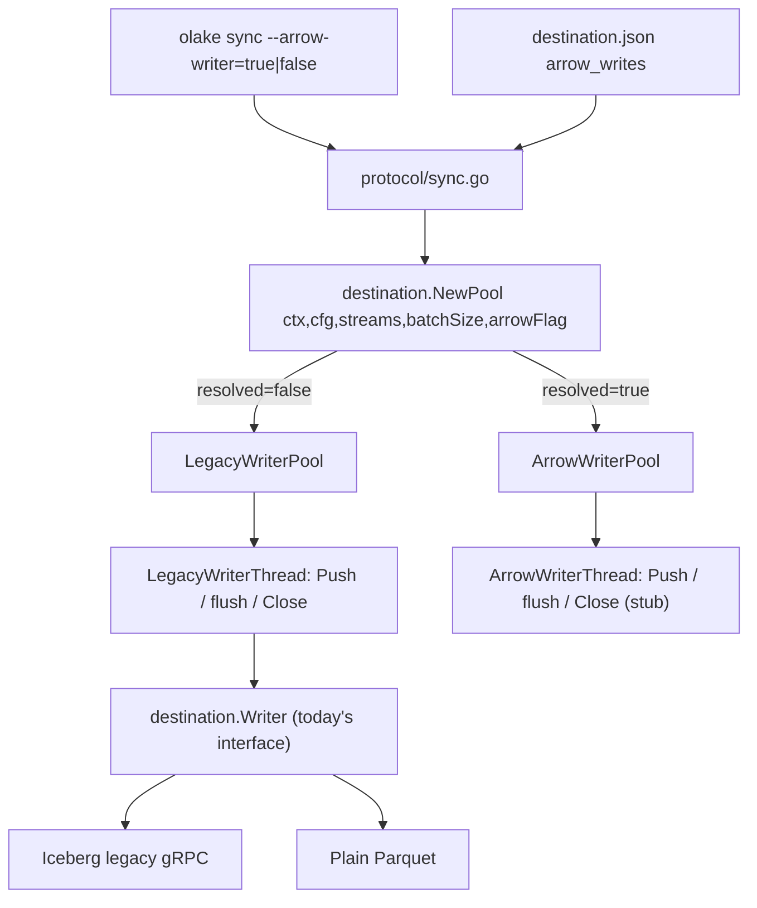

# Writer Pool Abstraction Layer

Drivers stop depending on concrete `*destination.WriterPool` / `*destination.WriterThread`. They use the `destination.Pool` / `destination.Thread` interfaces. Two implementations sit behind those interfaces:

- `LegacyWriterPool` / `LegacyWriterThread` — today's behaviour (flatten in Go, call `Writer.Write` per batch).
- `ArrowWriterPool` / `ArrowWriterThread` — a skeleton for the arrow-native path. Real arrow logic lands later.

Selection happens at `olake sync` time via a new CLI flag `--arrow-writer`. The flag overrides any `arrow_writes` field that might exist in the destination JSON.

All **shared** logic (interfaces, `Options`, `Stats`, `writerSchema` mutex, panic-recovered flush wrapper, the `NewPool` dispatcher, `ClearDestination`, `RegisteredWriters`) lives in **one** file: `destination/writer.go`. Each pool only contributes the bits that genuinely differ.

---

## 1. High-level flow



### Flag precedence

1. `--arrow-writer=true|false` on CLI wins.
2. Else `arrow_writes` from the destination JSON (best-effort `map[string]any` peek).
3. Else `false` (legacy).

---

## 2. File layout

| File | New? | Purpose |
|---|---|---|
| `destination/writer.go` | new | All shared types, interfaces, helpers, dispatcher, `ClearDestination`, `RegisteredWriters` |
| `destination/legacy_pool.go` | new | `LegacyWriterPool` + `LegacyWriterThread` (today's body, lifted) |
| `destination/arrow_pool.go` | new | `ArrowWriterPool` + `ArrowWriterThread` stub (arrow internals filled later) |
| `destination/writers.go` | deleted | Everything moved out — file goes away |
| `destination/interface.go` | unchanged | `Writer` interface stays as-is |
| `protocol/root.go` | edited | Register `--arrow-writer` persistent flag |
| `protocol/sync.go` | edited | Call `destination.NewPool` with optional flag override |
| `drivers/abstract/interface.go` | edited | `GetOrSplitChunks` takes `destination.Pool` |
| `drivers/abstract/backfill.go`<br>`drivers/abstract/incremental.go`<br>`drivers/abstract/cdc.go` | edited | Use `destination.Pool` / `destination.Thread` (interface, not pointer) |
| `drivers/abstract/abstract.go` | edited | `handleWriterCleanup` switches on interface types |
| `drivers/<each>/internal/backfill.go` | edited | Mechanical: `*destination.WriterPool` → `destination.Pool` in `GetOrSplitChunks` signature |

---

## 3. Code listings

### 3.1 `destination/writer.go` (new — single home for shared logic)

```go
package destination

import (
	"context"
	"fmt"
	"sync"
	"sync/atomic"

	"github.com/datazip-inc/olake/types"
	"github.com/datazip-inc/olake/utils"
)

// ---------------------------------------------------------------------------
// Interfaces drivers consume.
// ---------------------------------------------------------------------------

// Pool is the minimum contract drivers use. Both LegacyWriterPool and
// ArrowWriterPool implement it.
type Pool interface {
	NewWriter(ctx context.Context, stream types.StreamInterface, options ...ThreadOptions) (Thread, *types.MetadataState, error)
	AddRecordsToSyncStats(count int64)
	GetStats() *Stats
}

// Thread is the minimum contract for a per-thread writer. Both
// LegacyWriterThread and ArrowWriterThread implement it.
type Thread interface {
	Push(ctx context.Context, record types.RawRecord) error
	Close(ctx context.Context, finalMetadataState any) error
}

// ---------------------------------------------------------------------------
// Shared option / stats / artifact types.
// ---------------------------------------------------------------------------

type (
	NewFunc        func() Writer
	InsertFunction func(record types.RawRecord) error
	CloseFunction  func()
	WriterOption   func(Writer) error

	Options struct {
		Identifier  string
		Number      int64
		Backfill    bool
		ThreadID    string
		ApplyFilter bool
	}

	ThreadOptions func(opt *Options)

	Stats struct {
		TotalRecordsToSync atomic.Int64
		ReadCount          atomic.Int64
		RecordsFiltered    atomic.Int64
		ThreadCount        atomic.Int64
	}

	// writerSchema is the per-stream artifact shared across all threads of a
	// given pool. Both pools mutate it under writerSchema.mu.
	writerSchema struct {
		mu            sync.RWMutex
		schema        any
		metadataState *types.MetadataState
	}
)

// Registry for legacy writers. Arrow destinations can plug in later through a
// parallel registry; for now there is none.
var RegisteredWriters = map[types.DestinationType]NewFunc{}

// ---------------------------------------------------------------------------
// ThreadOption builders.
// ---------------------------------------------------------------------------

func WithIdentifier(v string) ThreadOptions  { return func(o *Options) { o.Identifier = v } }
func WithNumber(v int64) ThreadOptions       { return func(o *Options) { o.Number = v } }
func WithBackfill(v bool) ThreadOptions      { return func(o *Options) { o.Backfill = v } }
func WithThreadID(v string) ThreadOptions    { return func(o *Options) { o.ThreadID = v } }
func WithApplyFilter(v bool) ThreadOptions   { return func(o *Options) { o.ApplyFilter = v } }

// ---------------------------------------------------------------------------
// Entry point used by protocol/sync.go.
// ---------------------------------------------------------------------------

// NewPool picks the right implementation:
//
//   - arrowOverride == nil  -> read arrow_writes from destination config
//   - arrowOverride != nil  -> CLI value wins
func NewPool(ctx context.Context, cfg *types.WriterConfig, syncStreams []string, batchSize int64, arrowOverride *bool) (Pool, error) {
	if resolveArrowMode(cfg, arrowOverride) {
		return newArrowWriterPool(ctx, cfg, syncStreams, batchSize)
	}
	return newLegacyWriterPool(ctx, cfg, syncStreams, batchSize)
}

func resolveArrowMode(cfg *types.WriterConfig, arrowOverride *bool) bool {
	if arrowOverride != nil {
		return *arrowOverride
	}
	if raw, ok := cfg.WriterConfig.(map[string]any); ok {
		if v, ok := raw["arrow_writes"].(bool); ok {
			return v
		}
	}
	return false
}

// ---------------------------------------------------------------------------
// Helpers used by both pools.
// ---------------------------------------------------------------------------

func newStats() *Stats {
	return &Stats{
		TotalRecordsToSync: atomic.Int64{},
		ThreadCount:        atomic.Int64{},
		ReadCount:          atomic.Int64{},
		RecordsFiltered:    atomic.Int64{},
	}
}

func registerStreamArtifacts(m *sync.Map, streams []string) {
	for _, s := range streams {
		m.Store(s, &writerSchema{
			mu:     sync.RWMutex{},
			schema: nil,
		})
	}
}

func loadStreamArtifact(m *sync.Map, streamID string) (*writerSchema, error) {
	raw, ok := m.Load(streamID)
	if !ok {
		return nil, fmt.Errorf("failed to get stream artifacts for stream[%s]", streamID)
	}
	a, ok := raw.(*writerSchema)
	if !ok {
		return nil, fmt.Errorf("failed to convert raw stream artifact[%T] to *writerSchema", raw)
	}
	return a, nil
}

func applyThreadOpts(options []ThreadOptions) *Options {
	opts := &Options{}
	for _, one := range options {
		one(opts)
	}
	return opts
}

// runRecoveredFlush is the standard panic-recovered wrapper used by both
// thread implementations.
func runRecoveredFlush(fn func() error) (err error) {
	defer func() {
		if err == nil {
			if rec := recover(); rec != nil {
				err = fmt.Errorf("panic recovered in flush: %v", rec)
			}
		}
	}()
	return fn()
}

// ---------------------------------------------------------------------------
// ClearDestination — unchanged behaviour; lives here now.
// ---------------------------------------------------------------------------

func ClearDestination(ctx context.Context, config *types.WriterConfig, dropStreams []types.StreamInterface) error {
	newfunc, found := RegisteredWriters[config.Type]
	if !found {
		return fmt.Errorf("invalid destination type has been passed [%s]", config.Type)
	}
	adapter := newfunc()
	if err := utils.Unmarshal(config.WriterConfig, adapter.GetConfigRef()); err != nil {
		return err
	}
	if dropStreams != nil {
		if err := adapter.DropStreams(ctx, dropStreams); err != nil {
			return fmt.Errorf("failed to drop the streams: %s", err)
		}
	}
	return nil
}
```

### 3.2 `destination/legacy_pool.go` (new — body lifted from today's `writers.go`)

```go
package destination

import (
	"context"
	"fmt"
	"sync"

	"github.com/datazip-inc/olake/types"
	"github.com/datazip-inc/olake/utils"
	"github.com/datazip-inc/olake/utils/logger"
)

type LegacyWriterPool struct {
	configMutex  sync.Mutex
	stats        *Stats
	config       any
	init         NewFunc
	writerSchema sync.Map
	batchSize    int64
}

type LegacyWriterThread struct {
	stats          *Stats
	buffer         []types.RawRecord
	threadID       string
	writer         Writer
	batchSize      int64
	streamArtifact *writerSchema
	group          *utils.CxGroup
}

func newLegacyWriterPool(ctx context.Context, config *types.WriterConfig, syncStreams []string, batchSize int64) (*LegacyWriterPool, error) {
	newfunc, found := RegisteredWriters[config.Type]
	if !found {
		return nil, fmt.Errorf("invalid destination type has been passed [%s]", config.Type)
	}
	adapter := newfunc()
	if err := utils.Unmarshal(config.WriterConfig, adapter.GetConfigRef()); err != nil {
		return nil, err
	}
	if err := adapter.Check(ctx); err != nil {
		return nil, fmt.Errorf("failed to test destination: %s", err)
	}

	pool := &LegacyWriterPool{
		stats:     newStats(),
		config:    config.WriterConfig,
		init:      newfunc,
		batchSize: batchSize,
	}
	registerStreamArtifacts(&pool.writerSchema, syncStreams)
	return pool, nil
}

func (w *LegacyWriterPool) AddRecordsToSyncStats(count int64) { w.stats.TotalRecordsToSync.Add(count) }
func (w *LegacyWriterPool) GetStats() *Stats                  { return w.stats }

func (w *LegacyWriterPool) NewWriter(ctx context.Context, stream types.StreamInterface, options ...ThreadOptions) (Thread, *types.MetadataState, error) {
	w.stats.ThreadCount.Add(1)
	opts := applyThreadOpts(options)

	artifact, err := loadStreamArtifact(&w.writerSchema, stream.ID())
	if err != nil {
		return nil, nil, err
	}

	var writerImpl Writer
	prevStreamState, err := func() (*types.MetadataState, error) {
		writerImpl = w.init()
		w.configMutex.Lock()
		err := utils.Unmarshal(w.config, writerImpl.GetConfigRef())
		w.configMutex.Unlock()
		if err != nil {
			return nil, err
		}

		artifact.mu.Lock()
		defer artifact.mu.Unlock()

		output, prev, err := writerImpl.Setup(ctx, stream, artifact.schema, opts)
		if err != nil {
			return nil, fmt.Errorf("failed to setup the writer thread: %s", err)
		}
		if artifact.schema == nil {
			artifact.schema = output
			artifact.metadataState = prev
		}
		return artifact.metadataState, nil
	}()
	if err != nil {
		return nil, nil, fmt.Errorf("failed to setup writer thread: %s", err)
	}

	return &LegacyWriterThread{
		buffer:         []types.RawRecord{},
		batchSize:      w.batchSize,
		threadID:       opts.ThreadID,
		writer:         writerImpl,
		stats:          w.stats,
		streamArtifact: artifact,
		group:          utils.NewCGroupWithLimit(ctx, 1),
	}, prevStreamState, nil
}

func (wt *LegacyWriterThread) Push(ctx context.Context, record types.RawRecord) error {
	select {
	case <-ctx.Done():
		return ctx.Err()
	case <-wt.group.Ctx().Done():
		return wt.group.Block()
	default:
		wt.stats.ReadCount.Add(1)
		wt.buffer = append(wt.buffer, record)
		if len(wt.buffer) >= int(wt.batchSize) {
			buf := make([]types.RawRecord, len(wt.buffer))
			copy(buf, wt.buffer)
			wt.buffer = wt.buffer[:0]
			wt.group.Add(func(ctx context.Context) error { return wt.flush(ctx, buf) })
		}
		return nil
	}
}

func (wt *LegacyWriterThread) flush(ctx context.Context, buf []types.RawRecord) error {
	if len(buf) == 0 {
		return nil
	}
	return runRecoveredFlush(func() error {
		flushCtx, cancel := context.WithCancel(ctx)
		defer cancel()

		before := len(buf)
		evolution, buf, threadSchema, err := wt.writer.FlattenAndCleanData(flushCtx, buf)
		if err != nil {
			return fmt.Errorf("failed to flatten and clean data: %s", err)
		}
		wt.stats.RecordsFiltered.Add(int64(before - len(buf)))

		if evolution {
			wt.streamArtifact.mu.Lock()
			newSchema, evErr := wt.writer.EvolveSchema(flushCtx, wt.streamArtifact.schema, threadSchema)
			if evErr == nil && newSchema != nil {
				wt.streamArtifact.schema = newSchema
			}
			wt.streamArtifact.mu.Unlock()
			if evErr != nil {
				return fmt.Errorf("failed to evolve schema: %s", evErr)
			}
		}

		if err := wt.writer.Write(flushCtx, buf); err != nil {
			return fmt.Errorf("failed to write records: %s", err)
		}
		logger.Infof("Thread[%s]: successfully wrote %d records", wt.threadID, len(buf))
		return nil
	})
}

func (wt *LegacyWriterThread) Close(ctx context.Context, finalMetadataState any) (err error) {
	select {
	case <-ctx.Done():
		if closeErr := wt.writer.Close(ctx, finalMetadataState); closeErr != nil {
			return fmt.Errorf("failed to close writer: %s", closeErr)
		}
		return nil
	default:
		defer wt.stats.ThreadCount.Add(-1)
		defer func() {
			wt.streamArtifact.mu.Lock()
			defer wt.streamArtifact.mu.Unlock()
			closeErr := wt.writer.Close(ctx, finalMetadataState)
			if closeErr != nil {
				err = utils.Ternary(err == nil, closeErr, fmt.Errorf("%s: flush error: %w", closeErr, err)).(error)
			}
		}()
		wt.group.Add(func(ctx context.Context) error { return wt.flush(ctx, wt.buffer) })
		if err := wt.group.Block(); err != nil {
			return fmt.Errorf("failed to flush data while closing: %s", err)
		}
		return nil
	}
}
```

### 3.3 `destination/arrow_pool.go` (new — minimal skeleton; logic deferred)

```go
package destination

import (
	"context"
	"fmt"

	"github.com/datazip-inc/olake/types"
)

// ArrowWriterPool is a stub for now. Implementation lands when the arrow
// pipeline (flatten / partition / dedup / rolling parquet) is built out.
type ArrowWriterPool struct {
	stats     *Stats
	config    any
	batchSize int64
}

// ArrowWriterThread is a stub. It satisfies destination.Thread so drivers
// compile, but Push / Close return an explicit "not implemented" error so the
// stub can't be used in production by accident.
type ArrowWriterThread struct {
	stats    *Stats
	threadID string
}

func newArrowWriterPool(_ context.Context, config *types.WriterConfig, _ []string, batchSize int64) (*ArrowWriterPool, error) {
	return &ArrowWriterPool{
		stats:     newStats(),
		config:    config.WriterConfig,
		batchSize: batchSize,
	}, nil
}

func (w *ArrowWriterPool) AddRecordsToSyncStats(count int64) { w.stats.TotalRecordsToSync.Add(count) }
func (w *ArrowWriterPool) GetStats() *Stats                  { return w.stats }

func (w *ArrowWriterPool) NewWriter(_ context.Context, _ types.StreamInterface, options ...ThreadOptions) (Thread, *types.MetadataState, error) {
	w.stats.ThreadCount.Add(1)
	opts := applyThreadOpts(options)
	return &ArrowWriterThread{stats: w.stats, threadID: opts.ThreadID}, nil, nil
}

func (wt *ArrowWriterThread) Push(_ context.Context, _ types.RawRecord) error {
	return fmt.Errorf("arrow writer thread[%s]: Push not implemented yet", wt.threadID)
}

func (wt *ArrowWriterThread) Close(_ context.Context, _ any) error {
	defer wt.stats.ThreadCount.Add(-1)
	return fmt.Errorf("arrow writer thread[%s]: Close not implemented yet", wt.threadID)
}
```

> When the real arrow logic is written, fill in `Push` (buffer + batch threshold), `flush` (Arrow conversion + roll parquet + persist), and `Close` (final flush + commit). The shared helpers in `writer.go` (`runRecoveredFlush`, `loadStreamArtifact`, `applyThreadOpts`, `registerStreamArtifacts`, `newStats`) can be reused unchanged.

### 3.4 `destination/writers.go` — delete

Everything in today's `writers.go` (the old `WriterPool`, `WriterThread`, the option helpers, `Stats`, `ClearDestination`) is now in `writer.go` + `legacy_pool.go`. **The file is removed.**

### 3.5 `protocol/root.go` — add the flag

In the `var (...)` block:

```go
var (
	// ... existing vars ...
	arrowWriterFlag bool
)
```

Inside `init()` after the existing flag registrations:

```go
RootCmd.PersistentFlags().BoolVarP(&arrowWriterFlag, "arrow-writer", "", false,
    "(Optional) Force the arrow writer pipeline. Overrides the destination JSON arrow_writes field.")
```

### 3.6 `protocol/sync.go` — call the dispatcher

Replace the current `NewWriterPool` call:

```go
var arrowOverride *bool
if cmd.Flags().Changed("arrow-writer") {
    v := arrowWriterFlag
    arrowOverride = &v
}

pool, err := destination.NewPool(cmd.Context(), destinationConfig,
    selectedStreamsMetadata.SelectedStreams, batchSize, arrowOverride)
if err != nil {
    return err
}
```

`pool.GetStats()` and `pool.AddRecordsToSyncStats(...)` continue to work because both pools implement `destination.Pool`.

### 3.7 `drivers/abstract/interface.go` — signature swap

```go
type DriverInterface interface {
	// ... unchanged ...
	GetOrSplitChunks(ctx context.Context, pool destination.Pool, stream types.StreamInterface) (*types.Set[types.Chunk], error)
	// ... unchanged ...
}
```

### 3.8 `drivers/abstract/{backfill,incremental,cdc}.go`

Change function signatures and local variables:

```go
// backfill.go
func (a *AbstractDriver) Backfill(mainCtx context.Context, backfilledStreams chan string, pool destination.Pool, stream types.StreamInterface) error {
    // body unchanged; pool.NewWriter now returns destination.Thread
}

// incremental.go
func (a *AbstractDriver) Incremental(mainCtx context.Context, pool destination.Pool, streams ...types.StreamInterface) error { ... }

// cdc.go
func (a *AbstractDriver) RunChangeStream(mainCtx context.Context, pool destination.Pool, streams ...types.StreamInterface) error { ... }

// inside streamChanges:
writers := make(map[string]destination.Thread)
```

`inserter` / `writer` variables become `destination.Thread`. Method calls (`Push`, `Close`) are unchanged.

### 3.9 `drivers/abstract/abstract.go` — `handleWriterCleanup`

```go
switch w := writer.(type) {
case destination.Thread:
    if threadErr := w.Close(ctx, metadataState); threadErr != nil {
        closeErr = fmt.Errorf("failed to close writer: %s", threadErr)
    }
case map[string]destination.Thread:
    for streamID, inserter := range w {
        if inserter != nil {
            if threadErr := inserter.Close(ctx, metadataState); threadErr != nil {
                closeErr = fmt.Errorf("%s; failed closing writer[%s]: %s", closeErr, streamID, threadErr)
            }
        }
    }
default:
    closeErr = fmt.Errorf("unsupported writer type: %T", writer)
}
```

### 3.10 Per-driver `GetOrSplitChunks`

Each driver's `internal/backfill.go` (`postgres`, `mysql`, `mongodb`, `mssql`, `oracle`, `db2`, `kafka`, `s3`) currently signs `func (... pool *destination.WriterPool ...)`. Change to `func (... pool destination.Pool ...)`. No other change is required because the body only uses methods now present on the interface (typically just `pool.AddRecordsToSyncStats`).

---

## 4. Edge cases (acceptance checklist)

| Situation | Behaviour |
|---|---|
| `--arrow-writer=true` | Arrow pool selected; if its stub Push is called → explicit "not implemented" error (deliberate, until the real arrow path lands) |
| `--arrow-writer=false`, destination JSON says `arrow_writes:true` | CLI wins → legacy path |
| Neither set | Legacy path |
| `--arrow-writer` with no value | Cobra treats as `true` |
| Empty buffer at flush | Legacy thread short-circuits nil |
| Panic in flush | Recovered into `err` via `runRecoveredFlush` (shared) |
| `ctx.Done()` during Close | Skip flush, still call `writer.Close` |
| Schema race across threads | `writerSchema.mu` shared via the helpers in `writer.go` |
| Stats parity | Both pools call `newStats()`; identical fields |
| `clear` CLI path | Still uses `destination.ClearDestination` (now in `writer.go`); unchanged behaviour |

---

## 5. Migration order

1. Create `destination/writer.go` with shared interfaces + helpers + dispatcher + `ClearDestination` + `RegisteredWriters`.
2. Create `destination/legacy_pool.go` by lifting today's `WriterPool` / `WriterThread` and renaming.
3. Create `destination/arrow_pool.go` stub.
4. Delete `destination/writers.go`.
5. Update `protocol/root.go` + `protocol/sync.go` for the `--arrow-writer` flag and `NewPool` call.
6. Update `drivers/abstract/interface.go` (`GetOrSplitChunks` signature).
7. Update `drivers/abstract/{backfill,incremental,cdc,abstract}.go` to use `destination.Pool` / `destination.Thread`.
8. Update every driver's `internal/backfill.go` `GetOrSplitChunks` signature.
9. `make gofmt && make golangci`.
10. Run the e2e procedure from `.cursor/rules/olake.mdc` section 6 with Postgres + Iceberg. Default path (no flag) should reproduce today's behaviour exactly.

---

## 6. Out of scope

- Real arrow Push/flush/Close — `ArrowWriterThread` returns "not implemented" until that work happens.
- New `ArrowAdapter` interface or registry — deliberately omitted; will be designed alongside the actual arrow pipeline.
- Removing the `arrow_writes` JSON field — kept for backward compatibility.
- Java gRPC server, legacy Iceberg writer, plain Parquet writer internals.
